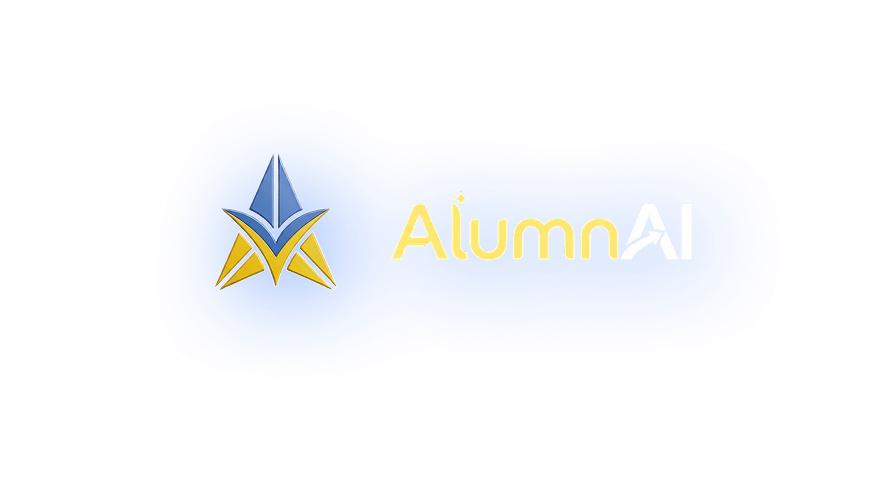

  

---

## About

AlumnAI is a capstone project developed for National University – Dasmariñas. 
It is a web and mobile-based alumni tracer management system designed to streamline alumni tracking, automate tracer surveys, and provide data-driven insights through analytics and machine learning.

---

## Features

- Alumni Management
- Tracer Survey
- Dashboard Analytics
- Reports
- Announcements
- Rewards
- Mobile Application
- AI-Powered Insights

---

## Technologies

- React + Vite
- Flutter
- Supabase
- PostgreSQL
- Python
- Scikit-learn

---

## License

AlumnAI © 2026
